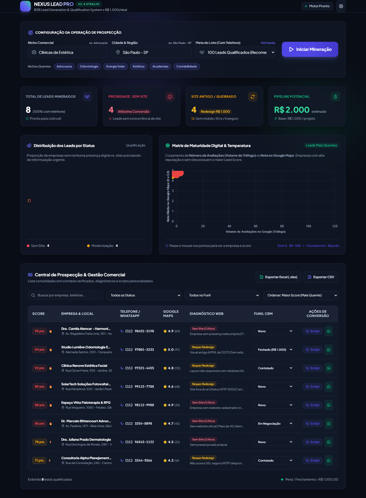
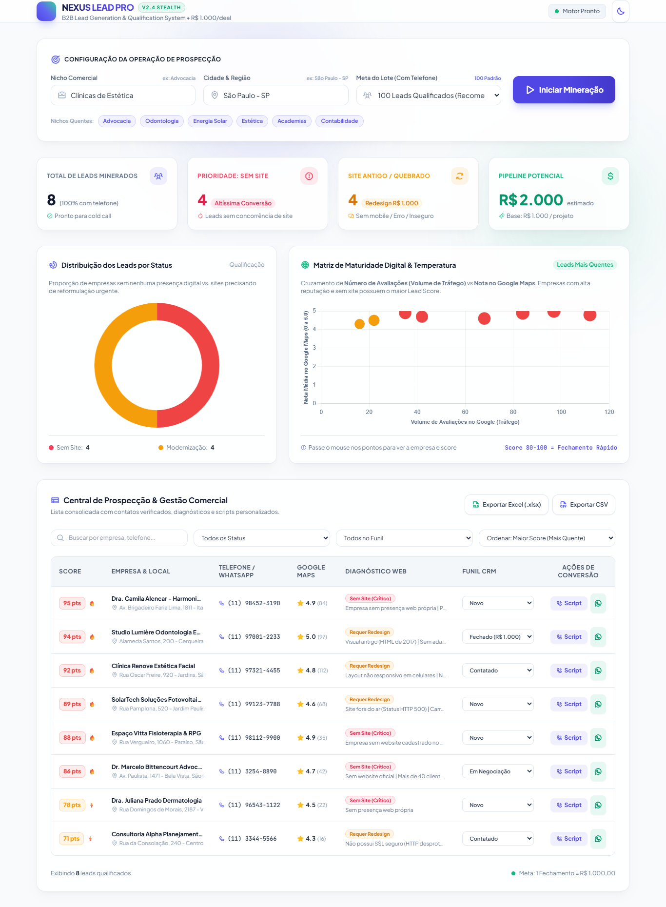

# 🚀 NEXUS LEAD PRO // B2B Growth Engine
> Robô profissional de prospecção ativa no Google Maps, qualificação técnica de presença web e CRM comercial focado na venda de **Landing Pages e Modernização de Sites por R$ 1.000,00**.

---

## 📸 Demonstração Visual da Interface

| Dark Mode Executivo | Light Mode Minimalista Clean |
| :---: | :---: |
|  |  |

---

## 🎯 Arquitetura da Solução

O sistema foi arquitetado em conformidade com as melhores práticas de Engenharia de Software e Growth Hacking B2B, dividido em 4 módulos principais:

### 1. Motor de Raspagem Stealth (`scraper.py`)
- **Alvo**: Google Maps (`https://www.google.com/maps/search/...`)
- **Driver**: Playwright integrado diretamente ao **Google Chrome nativo** do sistema operacional, contornando bloqueios de proxy corporativo e CAPTCHAs.
- **Scroll Inteligente**: Varre o feed de resultados dinamicamente até atingir exatamente o lote definido (ex: 50 ou 100 leads).
- **Filtro de Telefone Válido**: Requisito mandatório — descarta empresas sem telefone/WhatsApp, garantindo 100% de leads acionáveis para o SDR/vendedor.

### 2. Auditor Técnico de Sites (`auditor.py`)
- Se **'Website' estiver VAZIO** ➔ Classificado como `🚨 Prioridade Crítica: Sem Site`.
- Se **'Website' estiver PREENCHIDO** ➔ Executa auditoria técnica em tempo real com os seguintes critérios:
  * Ausência de `<meta name="viewport">` (layout quebrado/não responsivo em smartphones).
  * Ausência de certificado SSL válido (site inseguro HTTP em vez de HTTPS).
  * Erros de disponibilidade (Status HTTP 404, 500, 502, 503).
  * Tempo de carregamento excessivo (> 4.5s) e tags de tecnologias legadas.
  * Classificado como `⚡ Oportunidade: Modernização de Site`.

### 3. Lead Scoring & Copywriting de Conversão (`pitch_generator.py`)
- **Lead Score (0 a 100)**: Cruza **Volume de Avaliações** + **Nota no Google Maps** + **Falha Web** + **Telefone Válido**. Empresas com muitas avaliações (alto tráfego local) e sem site recebem nota 90-100 (`🔥 Super Quente`).
- **Gerador de Roteiro de Cold Call**: Cria dinamicamente a quebra de gelo parabenizando pela nota e avaliações reais, aponta a dor da perda de clientes no celular e apresenta a oferta fechada de Landing Page por **R$ 1.000,00**, com tratamento de 3 objeções frequentes.
- **Botão WhatsApp Web 1-Clique**: Gera link direto `https://wa.me/55...` com a copy persuasiva preenchida para iniciar contato imediato.

### 4. Dashboard Web & CRM Comercial (`app.py`, `templates/`, `static/`)
- Desenvolvido com **Flask + Tailwind CSS + Chart.js + Phosphor Icons**.
- **Dual Theme**: Alternância instantânea entre Dark Mode e Light Mode.
- **Streaming ao Vivo (SSE)**: Barra de progresso animada e feed de logs do terminal em tempo real.
- **Gestão de Funil CRM**: Status interativos (*Novo, Contatado, Em Negociação, Fechado R$ 1.000, Perdido*).
- **Exportação 1-Clique**: Relatórios completos em Excel (`.xlsx`) e CSV com compatibilidade Windows Excel (UTF-8 BOM).

---

## ⚡ Como Executar o Sistema

### Opção 1: Pelo Atalho Rápido (Recomendado)
Basta dar dois cliques no arquivo:
```cmd
iniciar_sistema.bat
```
O script ativará o ambiente virtual `.venv` e abrirá seu navegador padrão em `http://127.0.0.1:5000`.

### Opção 2: Pelo Terminal
```powershell
# Ativar ambiente virtual
.\.venv\Scripts\activate

# Iniciar o servidor
python app.py
```
Acesse no seu navegador: `http://127.0.0.1:5000`

---

## 💼 Scripts Comerciais Integrados

Cada lead capturado possui seu modal individual com:
1. **Script de Ligação (Cold Call)** pronto para leitura na tela com variáveis dinâmicas da empresa.
2. **Mensagem de WhatsApp** personalizada com emojis e copy de alto impacto.
3. Botão para abrir o WhatsApp Web diretamente com o texto digitado.
